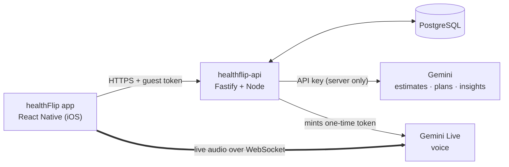

# healthFlip: Overview

The short version. For full details see [TECHNICAL_GUIDE.md](TECHNICAL_GUIDE.md).

## What it is

healthFlip is a meal-first calorie and nutrition app (wellness guidance, never diagnosis). There's no login: each install is an anonymous **guest** with a private token. Its AI coach, **Flip**, can talk with you live, log meals, remember your preferences, and build meal plans. Workouts and steps are paused while the app focuses on meals.

**Features:**
- **Meal logging:** the **+** button opens a chat where Flip asks what you ate. Answer by typing, with a camera or library photo (iPhone HEIC included), or by voice. AI lists **each item with an approximate weight**; you tick or untick items, adjust weights by ±10 g, or type anything it missed, and the totals update live. Nothing is saved until you tap **Log it**, and confirmed meals then appear under "Your meals" in Pick from list. "Not quite" lets you correct it, and "Pick from list" opens the manual form.
- **Home (minimal):** calories eaten, calories left and a progress ring, plus a simple list of today's meals. **Details** expands to show macros, Flip's nudge, and links to edit the goal or recalculate the plan.
- **Onboarding:** a text chat with Flip asks your name, age, height, weight, sex, activity level and goal, then recommends a daily calorie target and macros.
- **Flip (voice):** a real-time spoken conversation that works in English, Hinglish and Hindi. Flip can:
  - show meal cards you confirm with a tap;
  - remember facts about you, like "vegetarian" or "gym at 7am";
  - create meal plans on request.
- **Health reports:** upload a lab report as photos (up to 5 pages) or a PDF. Flip lists every value with the lab's own range and a Low/Normal/High flag, explains it in plain words, and suggests food changes. You untick anything misread before saving; only the confirmed values are stored, never the file. Flip then uses the latest report in meal tips, the daily nudge, voice chats and meal plans.
- **Water:** a daily goal (suggested from a report, or set yourself), a Home card with +250 ml (long-press +500) and undo, and phone reminders every 1–3 h from 9:00 to 21:00.
- **Home Screen widget (iOS 17+):** small, medium and Lock Screen sizes showing calories eaten/left, macros, water and Flip's nudge or the next reminder. "Log meal" opens the add-meal chat.
- **Plans:** generate meal plans (1, 3 or 7 days), save them, and **download them as a PDF**. Workout plans are hidden for now; any saved earlier still open.
- **Also:** a Progress tab (history and charts), a Tips tab, and a Profile screen where you can see and delete what Flip remembers, or reset everything.

## How it fits together



**Ground rules:**
- The Gemini key never reaches the phone. Voice uses a one-time token that locks Flip's voice, instructions and tools.
- Every AI answer is checked against strict rules before it's shown or saved.
- Every AI feature has a non-AI fallback, so the app still works when AI is down or out of quota.
- Raw audio and conversations are never stored.

## Tech stack

| Layer | Technologies |
|---|---|
| Mobile | React Native 0.87, React 19, TypeScript, Reanimated 4, Skia (particle orb), Nitro realtime audio (live mic and speaker), image picker (photos, HEIC-aware), document picker (report PDFs), an in-repo Swift module (local reminders, widget data), a WidgetKit extension (SwiftUI), HealthKit (installed, paused), blob-util (PDF download), SVG, AsyncStorage |
| Backend | Node 22+, Fastify 5, Drizzle ORM, PostgreSQL 16, zod (validation), pdfkit (PDFs), tsx |
| AI | Gemini REST for structured JSON (a chain of models tried in order when one runs out of quota); Gemini Live `gemini-3.8-live` for voice, with the **Sulafat** voice and function calling |
| Tooling | Jest and Node's built-in test runner, ESLint, drizzle-kit migrations, Docker Postgres, Xcode/CocoaPods, Metro |

## AI at a glance

| Operation | Notes |
|---|---|
| Meal estimate (text and photo) | Calories, protein, carbs, fat, confidence and assumptions; checked against valid ranges. Photos can be JPEG, PNG, WebP or HEIC/HEIF |
| Daily nudge | A short, supportive insight based on today's meals and your goal |
| Personal plan | Starts from the standard Mifflin-St Jeor formula; the AI personalises it, but must stay within 10% and never go below a safe floor |
| Meal plans | Use your profile, targets, Flip's memories and (optionally) your latest report; leave out foods you're allergic to; template plans as backup |
| Report reading | Gemini reads photos/PDFs; values copied exactly, flags only from the printed range, never invented (no AI = no reading). Notes that mention medication or diagnoses are dropped, and no water goal is suggested when kidney or heart markers are flagged |
| Flip voice tools | `show_meal_card`, `save_memory`, `create_plan` |

## Data

| Table | Holds |
|---|---|
| `guests`, `guest_sessions` | Anonymous users and their hashed tokens |
| `guest_profiles` | Name, age, height, weight, sex, activity |
| `goals` | Daily calories, plus optional macro and step targets |
| `meal_entries` | Logged meals |
| `guest_memories` | Facts Flip remembers (up to 50 per guest) |
| `health_reports` | Values you confirmed from lab reports, Flip's summary and food notes (no files) |
| `water_targets`, `water_logs` | Daily water goal and what you drank |
| `guest_foods` | Meals you confirmed from Flip estimates, offered again in "Pick from list" (up to 200, most recent first) |
| `wellness_plans` | Saved diet and workout plans |

The schema has 8 migrations (0000–0007).

## Running it locally

```bash
docker start healthflip-postgres
cd healthflip-api && npm run db:migrate && npm run dev   # set HOST=0.0.0.0 in .env so the phone can connect
cd healthFlip && npm start                              # then open the app on the iPhone
```

Adding a native library needs a full rebuild: `pod install`, then build in Xcode or with `xcodebuild` and `devicectl`.

## Quality

- **API:** 30 unit tests and 24 integration tests, all passing.
- **Mobile:** 46 tests, all passing.
- Live voice, plans and memory were also checked against the real Gemini API.

## Still to do

- Bring back workouts and steps once the meal experience is settled.
- Android build.
- Voice quality polish.
- Apply database migrations 0004–0007 in production.
- Interactive widget buttons (log water from the widget) with iOS App Intents.
- Push the commits to GitHub.
